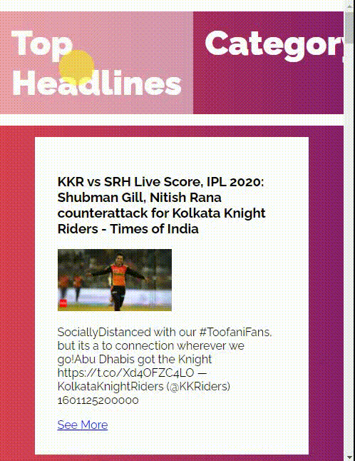

# flask-news-webApp

**This app has two sections
1.Top Headlines
2.Category

-In **Top Headlines** it renders top headlines from around the world.   
-In **Category** we can select category of news.    

**Used News Api**    
[News API](https://newsapi.org/)

---

**Desktop Version**    

   

---

**Mobile Version**     

